# MyEMS Database Architecture Document

> **Source-only analysis** — all facts derived from source code (`database/install/*.sql:1`, `myems-api/*:1`, `myems-aggregation/*:1`, `myems-normalization/*:1`, `myems-admin/*:1`, `myems-web/*:1`). No synthetic data generated.
> Date: 2026-08-24 | Version inspected: `6.8.0RC` (`database/install/myems_system_db.sql:2746` `tbl_versions`)

---

## 1. Executive Summary

| Metric | Value |
|---|---|
| **Databases** | **13** (`database/install/*.sql:7` each `CREATE DATABASE ... CHARACTER SET 'utf8mb4' COLLATE 'utf8mb4_unicode_ci'`) |
| **Total Tables** | **476** (`grep CREATE TABLE`: 160 + 12 + 39*7 + 9 + 8 + 4 + 10) |
| **Engine / Charset** | Implicit `InnoDB` (no `ENGINE=` clause), `utf8mb4`/`utf8mb4_unicode_ci` |
| **FK enforcement** | **None declarative** — 0× `FOREIGN KEY` in all 13 install files; integrity is application-level via `BIGINT *_id` + indexes |
| **Primary Key** | Uniform `id BIGINT NOT NULL AUTO_INCREMENT PRIMARY KEY` (except `myems_user_db.tbl_api_keys/tbl_verification_codes` use `INT`) |
| **Demo seed** | Only `myems_system_db` is seeded: `database/demo-en/myems_system_db.sql:1` (956 lines, 19 locale clones `database/demo-*/`) |
| **Aggregation** | 6 hourly clones + 1 yearly 8760 model — **234 + 39 = 273 hourly tables** sharing identical 4-column pattern |
| **API surface** | `myems-api/app.py:642` routes; `myems-api/config.py:4` declares 13 MySQL DSNs + Redis/MQTT |
| **Data flow** | Modbus/BACnet/S7 → `myems_historical_db` raw → `myems-normalization` hourly → `myems-aggregation` rollups (Energy/Billing/Carbon) → `myems-api/reports/*` → `myems-web`/`myems-admin` |

---

## 2. Methodology & Evidence Map

| Question | Source File(s) |
|---|---|
| **Schema / tables** | `database/install/myems_system_db.sql:1`, `myems_historical_db.sql:1`, `myems_energy_db.sql:1`, `myems_billing_db.sql:1`, `myems_carbon_db.sql:1`, `myems_energy_model_db.sql:1`, `myems_user_db.sql:1`, `myems_fdd_db.sql:1`, `myems_production_db.sql:1`, `myems_reporting_db.sql:1` |
| **Foreign keys** | Same files — absence of `FOREIGN KEY`, presence of `*_id BIGINT NOT NULL` + `CREATE INDEX` |
| **Equipment module** | `myems-api/core/equipment.py:76`, `myems-api/core/combinedequipment.py`, `database/install/myems_system_db.sql:732` |
| **Dashboard queries** | `myems-api/reports/dashboard.py:46`, `myems-api/reports/equipmentdashboard.py:67`, `myems-api/reports/spacedashboard.py:47` |
| **Seed / demo** | `database/demo-en/myems_system_db.sql:1`, `database/install/myems_system_db.sql:868` (gateway seed) |
| **Import scripts** | `myems-api/core/equipment.py:2603` (Export), `myems-api/core/equipment.py:2877` (Import), `myems-normalization/offlinemeter.py`, `myems-normalization/datarepair.py`, `others/entrypoint.sh:1` |
| **Data flow** | `myems-aggregation/main.py:71`, `myems-aggregation/equipment_energy_input_category.py:149`, `myems-normalization/main.py:60`, `myems-cleaning/main.py:54`, `docs/images/myems-data-flow-en.svg` |

---

## 3. Database Inventory

### 3.1 All 13 Databases

| # | DB Name | File | Tables | Purpose |
|---|---|---|---|---|
| 1 | `myems_system_db` | `database/install/myems_system_db.sql:6` | **160** | OLTP config — topology, masters, 80+ junction tables |
| 2 | `myems_historical_db` | `database/install/myems_historical_db.sql:6` | **12** | Raw timeseries + 4 file-blob tables |
| 3 | `myems_energy_db` | `database/install/myems_energy_db.sql:6` | **39** | Hourly energy rollups (source of truth for kWh) |
| 4 | `myems_billing_db` | `database/install/myems_billing_db.sql:7` | **39** | Hourly cost rollups (tariff applied) — schema clone of #3 |
| 5 | `myems_carbon_db` | `database/install/myems_carbon_db.sql:7` | **39** | Hourly carbon rollups (kgCO2e) — schema clone |
| 6 | `myems_energy_baseline_db` | `database/install/myems_energy_baseline_db.sql:7` | **39** | Baseline hourly (clone) |
| 7 | `myems_energy_plan_db` | `database/install/myems_energy_plan_db.sql:7` | **39** | Plan hourly (clone) |
| 8 | `myems_energy_prediction_db` | `database/install/myems_energy_prediction_db.sql:7` | **39** | Prediction hourly (clone) |
| 9 | `myems_energy_model_db` | `database/install/myems_energy_model_db.sql:7` | **39** | Yearly 8760 model (`hour_of_year INT` instead of `start_datetime_utc`) |
| 10 | `myems_fdd_db` | `database/install/myems_fdd_db.sql:7` | **9** | Fault Detection & Diagnostics |
| 11 | `myems_production_db` | `database/install/myems_production_db.sql:7` | **8** | Shopfloor production (products/teams/shifts) |
| 12 | `myems_reporting_db` | `database/install/myems_reporting_db.sql:7` | **4** | Scheduled reports + template/file blobs |
| 13 | `myems_user_db` | `database/install/myems_user_db.sql:7` | **10** | Users, privileges, sessions, logs, API keys |

Total: `160+12+39*7+9+8+4+10 = 476`

### 3.2 Global Conventions

- **Charset**: `CHARACTER SET 'utf8mb4' COLLATE 'utf8mb4_unicode_ci'` on `CREATE DATABASE` (`database/install/myems_system_db.sql:7`, `myems_historical_db.sql:7`, all others)
- **Engine**: No `ENGINE=InnoDB` clause → defaults to InnoDB (transactions used via `START TRANSACTION` in `database/demo-en/myems_system_db.sql:6`)
- **PK**: `id BIGINT NOT NULL AUTO_INCREMENT PRIMARY KEY (id)` universally
- **UUID**: `CHAR(36)` for cross-DB references (e.g., `numerator_meter_uuid` can be meter/offline/virtual uuid)
- **Decimal**: `DECIMAL(21,6)` post `database/upgrade/upgrade5.1.0.sql:1` (was `18,3`)
- **No FK DDL**: `0` occurrences of `FOREIGN KEY` across all 13 files; relationships via `*_id BIGINT NOT NULL` + `CREATE INDEX` on FK column

---

## 4. Table Catalog — `myems_system_db` (160 tables)

Largest DB, grouped below. Each row shows key columns and implicit FK target.

### 4.1 Masters / Dimensions

| Table | Columns (excerpt) | FKs (implicit) | Index | Line |
|---|---|---|---|---|
| `tbl_charging_stations` | `id,name,uuid,address,latitude,longitude,rated_capacity/power,contact_id,cost_center_id,svg_id*5,is_cost_data_displayed,phase_of_lifecycle` | `contact_id→tbl_contacts`, `cost_center_id→tbl_cost_centers` | `name` | `myems_system_db.sql:15` |
| `tbl_combined_equipments` | `id,name,uuid,is_input/output_counted,cost_center_id,efficiency_indicator,svg_id,camera_url` | `cost_center_id` | `name` | `myems_system_db.sql:45` |
| `tbl_commands` | `id,name,uuid,topic,payload LONGTEXT JSON,set_value DECIMAL` | — | `name` | `myems_system_db.sql:161` |
| `tbl_contacts` | `id,name,uuid,email,phone` | — | — | `myems_system_db.sql:178` |
| `tbl_cost_centers` | `id,name,uuid,external_id` | — | `name` | `myems_system_db.sql:222` |
| `tbl_data_sources` | `id,name,uuid,gateway_id,protocol,connection JSON,process_id,last_seen_datetime_utc` | `gateway_id→tbl_gateways` | `name,gateway_id,protocol` | `myems_system_db.sql:247` |
| `tbl_distribution_systems` | `id,name,uuid,svg_id` | `svg_id→tbl_svgs` | `name` | `myems_system_db.sql:301` |
| `tbl_distribution_circuits` | `id,name,uuid,distribution_system_id,distribution_room,switchgear,peak_load/current,customers,meters` | `distribution_system_id` | `distribution_system_id` | `myems_system_db.sql:267` |
| `tbl_energy_categories` | `id,name,uuid,unit_of_measure,kgce DECIMAL(21,6),kgco2e DECIMAL(21,6)` | — | `name` | `myems_system_db.sql:315` |
| `tbl_energy_items` | `id,name,uuid,energy_category_id` | `energy_category_id→tbl_energy_categories` | `name` | `myems_system_db.sql:330` |
| `tbl_energy_flow_diagrams` | `id,name,uuid` | — | `name` | `myems_system_db.sql:343` |
| `tbl_energy_storage_containers` | `id,name,uuid,rated_capacity/power,contact_id,cost_center_id` | `contact/cost_center` | `name` | `myems_system_db.sql:384` |
| `tbl_energy_storage_power_stations` | `id,name,uuid,address,latitude/longitude,rated_capacity/power,contact_id,cost_center_id,svg_id*5` | `contact/cost_center` | `name` | `myems_system_db.sql:679` |
| `tbl_equipments` | `id,name,uuid,is_input/output_counted,cost_center_id,efficiency_indicator,svg_id,camera_url` | `cost_center_id→tbl_cost_centers` | `name` | `myems_system_db.sql:736` |
| `tbl_gateways` | `id,name,uuid,token CHAR(36),last_seen_datetime_utc` | — | `name` | `myems_system_db.sql:854` + seed `myems_system_db.sql:868` `(1,Gateway1,dc681938...)` |
| `tbl_meters` | `id,name,uuid,energy_category_id,is_counted BOOL,hourly_low/high_limit,cost_center_id,energy_item_id,master_meter_id*` | `energy_category/item,cost_center,master_meter self` | `name,energy_category,energy_item` | `myems_system_db.sql:1080` |
| `tbl_offline_meters` | same without `master_meter_id` | `energy_category/item,cost_center` | `name,energy_category,energy_item` | `myems_system_db.sql:1466` |
| `tbl_virtual_meters` | `id,name,uuid,equation LONGTEXT,energy_category_id,is_counted,cost_center_id,energy_item_id` | `energy_category/item` | `name,energy_category,energy_item` | `myems_system_db.sql:2685` |
| `tbl_points` | `id,name VARCHAR(512),data_source_id,object_type ENUM{ENERGY_VALUE,ANALOG_VALUE,DIGITAL_VALUE,TEXT},units,high/low/higher/lower_limit,ratio,offset,is_trend/is_virtual/is_in_alarm,address JSON,faults JSON` | `data_source_id→tbl_data_sources` | `name,data_source,(id,object_type)` | `myems_system_db.sql:1759` |
| `tbl_sensors` | `id,name,uuid` | — | `name` | `myems_system_db.sql:1870` |
| `tbl_shopfloors` | `id,name,uuid,area,contact_id,is_input_counted,cost_center_id` | `contact/cost_center` | — | `myems_system_db.sql:1895` |
| `tbl_spaces` | `id,name,uuid,parent_space_id BIGINT NULL self-FK,area,number_of_occupants,timezone_id,contact_id,cost_center_id,is_input/output_counted,latitude/longitude` | `parent_space_id self`,`timezone_id→tbl_timezones` | `name,parent_space_id` | `myems_system_db.sql:2011` |
| `tbl_stores` | `id,name,uuid,address,latitude/longitude,area,store_type_id,contact_id,cost_center_id` | `store_type_id→tbl_store_types` | — | `myems_system_db.sql:2315` |
| `tbl_store_types` | `id,name,uuid,simplified_code` | — | — | `myems_system_db.sql:2348` |
| `tbl_tenants` | `id,name,uuid,buildings/floors/rooms,area,tenant_type_id,is_input_counted/is_key_tenant,lease_number/dates,is_in_lease,contact/cost_center` | `tenant_type_id` | — | `myems_system_db.sql:2449` |
| `tbl_tenant_types` | `id,name,uuid,simplified_code` | — | — | `myems_system_db.sql:2487` |
| `tbl_timezones` | `id,name,utc_offset` — 93 rows `myems_system_db.sql:2583` (56=Asia/Shanghai +08:00) | — | — | `myems_system_db.sql:2573` |
| `tbl_svgs` | `id,name,uuid,source_code LONGTEXT` | — | `name` | `myems_system_db.sql:2435` |
| `tbl_protocols` | 37 rows modbus-tcp … weather `myems_system_db.sql:1826` | — | — | `myems_system_db.sql:1819` |
| `tbl_menus` | `id,name,uuid,parent_menu_id,is_hidden` + route — 133 menus | `parent_menu_id self` | — | `myems_system_db.sql:934` |
| `tbl_tariffs` | `id,name,uuid,energy_category_id,tariff_type= timeofuse,unit_of_price,valid_from/through DATETIME` | `energy_category_id` | — | `myems_system_db.sql:2279` |
| `tbl_tariffs_timeofuses` | `id,tariff_id,start/end TIME,peak_type ENUM{toppeak,onpeak,midpeak,offpeak,deep},price DECIMAL(21,6)` | `tariff_id→tbl_tariffs` | — | `myems_system_db.sql:2298` |
| `tbl_microgrids` | `id,name,uuid,address,latitude/longitude/point_ids,rated_capacity/power,contact/cost_center,svg*5` | `contact/cost_center` | `name` | `myems_system_db.sql:1129` |
| `tbl_photovoltaic_power_stations` | `id,name,uuid,address,latitude/longitude,rated_capacity/power,contact/cost_center,svg*5` + invertor 60+ point_ids | `contact/cost_center` | `name` | `myems_system_db.sql:1488` |
| `tbl_wind_farms` | `id,name,uuid,address,latitude/longitude,rated_capacity/power,...` | `contact/cost_center` | `name` | `myems_system_db.sql:2769` |
| `tbl_virtual_power_plants` | `id,name,uuid` | — | `name` | `myems_system_db.sql:2721` |
| `tbl_working_calendars` | `id,name,uuid,description` + `tbl_working_calendars_non_working_days` | — | — | `myems_system_db.sql:2795` |
| `tbl_variables` | `id,name,virtual_meter_id,meter_type ENUM{meter,offline_meter,virtual_meter},meter_id` | `virtual_meter_id` | — | `myems_system_db.sql:2705` |
| `tbl_control_modes` | `id,name,uuid,is_active` | — | `name` | `myems_system_db.sql:192` |
| `tbl_control_modes_times` | `id,control_mode_id,start/end TIME,power_value/point_id/equation` | `control_mode_id` | `control_mode_id` | `myems_system_db.sql:205` |
| `tbl_iot_sim_cards` | `id,iccid,imsi,operator,status,active/open/expiration,used/total_traffic` | — | `iccid` | `myems_system_db.sql:898` |
| `tbl_fuel/heat/power_integrators` | `id,name,uuid,point_ids,coefficients` | `point_id→tbl_points` | `name` | `myems_system_db.sql:838`,`878`,`1804` |
| `tbl_knowledge_files` | `id,file_name,uuid,upload_datetime_utc,upload_user_uuid,file_object LONGBLOB` | — | `file_name,upload_time` | `myems_system_db.sql:918` |
| `tbl_versions` | `id,version,release_date` — single row `6.8.0RC` | — | — | `myems_system_db.sql:2750` |

`*` `tbl_meters.master_meter_id` self-hierarchy for sub-metering (`database/demo-en/myems_system_db.sql:359` Meter2,3 parent=1)

### 4.2 Equipment Subsystem (38 tables) — see §9

### 4.3 Energy Storage Containers Sub-tables (19 tables)

| Table | Key FK | Line |
|---|---|---|
| `tbl_energy_storage_containers_batteries` (`battery_state/soc/power_point_id,charge/discharge_meter_id,rated_capacity/power/nominal_voltage`) | `energy_storage_container_id` | `myems_system_db.sql:402` |
| `tbl_energy_storage_containers_power_conversion_systems` (`run_state_point_id,rated_output_power`) | `energy_storage_container_id` | `myems_system_db.sql:606` |
| `tbl_energy_storage_containers_grids` (`power_point_id,buy/sell_meter_id,capacity`) | `energy_storage_container_id` | `myems_system_db.sql:517` |
| `tbl_energy_storage_containers_loads` (`power_point_id,meter_id,rated_input_power`) | `energy_storage_container_id` | `myems_system_db.sql:575` |
| `tbl_energy_storage_containers_dcdcs/firecontrols/hvacs/stses` | `energy_storage_container_id` | `myems_system_db.sql:463`,`490`,`548`,`652` |
| `*_points` tables (`bmses/dcdcs/firecontrols/grids/hvacs/loads/pcses/stses_points`) | `bms_id/dcdc_id/...`→ parent | `myems_system_db.sql:424`,`477`,`504`,`535`,`562`,`593`,`622`,`666` |
| `tbl_energy_storage_containers_commands/data_sources/schedules` | `energy_storage_container_id` | `myems_system_db.sql:437`,`450`,`635` |
| `tbl_energy_storage_power_stations_containers` / `users` | `energy_storage_power_station_id` | `myems_system_db.sql:710`,`723` |

### 4.4 Microgrid / PV / Other Specialized

| Group | Tables | Line |
|---|---|---|
| **Microgrids** | `tbl_microgrids`, `tbl_microgrids_batteries`, `tbl_microgrids_power_conversion_systems`, `tbl_microgrids_grids`, `tbl_microgrids_loads`, `tbl_microgrids_generators`, `tbl_microgrids_heatpumps`, `tbl_microgrids_photovoltaics`, `tbl_microgrids_evchargers`, `tbl_microgrids_sensors`, `tbl_microgrids_schedules`, `tbl_microgrids_users`, `tbl_microgrids_commands/data_sources` + `*_points` (batteries/pcs/grids/loads/generators/heatpumps/pvs/evchargers) | `myems_system_db.sql:1129`-`1454` |
| **PV Stations** | `tbl_photovoltaic_power_stations`, `tbl_photovoltaic_power_stations_invertors` (60+ `pv*_u/i/p` point_ids + `generation_meter_id`), `tbl_photovoltaic_power_stations_grids/loads/users/data_sources` + `*_points` | `myems_system_db.sql:1488`-`1746` |
| **Distribution** | `tbl_distribution_systems`, `tbl_distribution_circuits`, `tbl_distribution_circuits_points` | `myems_system_db.sql:267`-`301` |
| **Energy Flow** | `tbl_energy_flow_diagrams`, `tbl_energy_flow_diagrams_nodes`, `tbl_energy_flow_diagrams_links` (`meter_uuid`) | `myems_system_db.sql:343`-`370` |

### 4.5 Junction Tables (80+ — pattern `id, parent_id, child_id`)

All follow `id BIGINT PK, <parent>_id BIGINT NOT NULL, <child>_id BIGINT NOT NULL, INDEX(parent_id)` — no composite UNIQUE, surrogate key.

| Parent | Junction Tables | Line |
|---|---|---|
| **Spaces** | `tbl_spaces_meters/offline_meters/virtual_meters/sensors/points/commands/distribution_systems/energy_flow_diagrams/energy_storage_power_stations/microgrids/photovoltaic_power_stations/shopfloors/stores/tenants/wind_farms/charging_stations/combined_equipments/equipments/working_calendars` | `myems_system_db.sql:2059`-`2267` |
| **Shopfloors** | `tbl_shopfloors_meters/offline_meters/virtual_meters/sensors/points/commands/equipments/working_calendars` | `myems_system_db.sql:1936`-`1998` |
| **Stores** | `tbl_stores_meters/offline_meters/virtual_meters/sensors/points/commands/working_calendars` | `myems_system_db.sql:2362`-`2422` |
| **Tenants** | `tbl_tenants_meters/offline_meters/virtual_meters/sensors/points/commands/working_calendars` | `myems_system_db.sql:2501`-`2561` |
| **Meters/Sensors** | `tbl_meters_points/commands`, `tbl_sensors_points` | `myems_system_db.sql:1104`,`1116`,`1883` |
| **Equipments** | See §9 | `myems_system_db.sql:755`-`831` |
| **Combined** | `tbl_combined_equipments_equipments/meters/offline_meters/virtual_meters/parameters/commands/data_sources` | `myems_system_db.sql:76`-`153` |

---

## 5. Historical DB — `myems_historical_db` (12 tables)

`database/install/myems_historical_db.sql:1` — raw timeseries, no FK constraints.

| Table | Columns | Indexes | Line |
|---|---|---|---|
| `tbl_analog_value` | `id, point_id, utc_date_time, actual_value DECIMAL(21,6), is_bad BOOL NULL, is_published BOOL NULL` | `(point_id,utc_date_time), (utc_date_time)` | `myems_historical_db.sql:15` |
| `tbl_analog_value_latest` | `id, point_id, utc_date_time, actual_value DECIMAL(21,6)` | same | `myems_historical_db.sql:31` |
| `tbl_digital_value` | `id, point_id, utc_date_time, actual_value INT, is_bad, is_published` | same | `myems_historical_db.sql:60` |
| `tbl_digital_value_latest` | same without flags | same | `myems_historical_db.sql:76` |
| `tbl_energy_value` | `id, point_id, utc_date_time, actual_value DECIMAL(21,6), is_bad, is_published` | same | `myems_historical_db.sql:91` |
| `tbl_energy_value_latest` | same without flags | same | `myems_historical_db.sql:107` |
| `tbl_text_value` | `id, point_id, utc_date_time, actual_value LONGTEXT, is_bad, is_published` | same | `myems_historical_db.sql:123` |
| `tbl_text_value_latest` | same without flags | same | `myems_historical_db.sql:139` |
| `tbl_cost_files` | `id, file_name, uuid, upload_datetime_utc, status ENUM{new,done,error}, file_object LONGBLOB` | — | `myems_historical_db.sql:46` |
| `tbl_offline_meter_files` | `id, file_name, uuid, upload_datetime_utc, status, file_object LONGBLOB` | — | `myems_historical_db.sql:154` |
| `tbl_data_repair_files` | same | — | `myems_historical_db.sql:169` |
| `tbl_energy_plan_files` | same | — | `myems_historical_db.sql:183` |

`*_latest` = materialized latest cache for realtime APIs (`myems-api/reports/pointrealtime.py` queries `_latest`).

---

## 6. Hourly Aggregation Family — 6×39 + 1×39 Model

**Source**: `database/install/myems_energy_db.sql:1` is template; `myems_billing_db.sql:1`, `myems_carbon_db.sql:1`, `myems_energy_baseline_db.sql:1`, `myems_energy_plan_db.sql:1`, `myems_energy_prediction_db.sql:1` are byte-identical except `CREATE DATABASE` name. `myems_energy_model_db.sql:1` replaces `start_datetime_utc DATETIME` with `hour_of_year INT`.

### 6.1 Pattern (hourly)

`id BIGINT PK, <entity>_id BIGINT NOT NULL, [energy_category_id|energy_item_id], start_datetime_utc DATETIME NOT NULL, actual_value DECIMAL(21,6) NOT NULL, INDEX(entity, [category/item], start_datetime_utc)`

Entities per DB (39 each):

| Group | Tables (suffix `_hourly`) |
|---|---|
| **Combined Equipment** | `tbl_combined_equipment_input_category_hourly`, `tbl_combined_equipment_input_item_hourly`, `tbl_combined_equipment_output_category_hourly` |
| **Equipment** | `tbl_equipment_input_category_hourly` (`myems_energy_db.sql:213`), `tbl_equipment_input_item_hourly` (`myems_energy_db.sql:229`), `tbl_equipment_output_category_hourly` (`myems_energy_db.sql:245`) |
| **Meters** | `tbl_meter_hourly` (`myems_energy_db.sql:261`), `tbl_offline_meter_hourly` (`myems_energy_db.sql:382`), `tbl_virtual_meter_hourly` (`myems_energy_db.sql:601`) |
| **Microgrids** | `tbl_microgrid_charge/discharge/grid_buy/grid_sell/load/evcharger/photovoltaic_hourly` (`myems_energy_db.sql:277`-`367`) |
| **Energy Storage Containers** | `tbl_energy_storage_container_charge/discharge/grid_buy/grid_sell/load_hourly` (`myems_energy_db.sql:63`-`123`) |
| **Energy Storage Power Stations** | `tbl_energy_storage_power_station_charge/discharge/grid_buy/grid_sell/load_hourly` (`myems_energy_db.sql:138`-`198`) |
| **PV** | `tbl_photovoltaic_power_station_generation/grid_buy/grid_sell/load_hourly` (`myems_energy_db.sql:397`-`442`) |
| **Org** | `tbl_shopfloor_input_category/item_hourly` (`myems_energy_db.sql:457`-`473`), `tbl_space_input_category/item/output_category_hourly` (`myems_energy_db.sql:489`-`521`), `tbl_store_input_category/item_hourly` (`myems_energy_db.sql:537`-`553`), `tbl_tenant_input_category/item_hourly` (`myems_energy_db.sql:569`-`585`) |

### 6.2 Yearly Model Variant — `myems_energy_model_db`

Same 39 tables, `_8760` suffix, `hour_of_year INT NOT NULL` (`myems_energy_model_db.sql:15`), index `(entity_id, [category/item], hour_of_year)` — stores 8760 values per entity/year for simulation.

### 6.3 Semantic Difference

Schema identical; meaning differs at aggregation time (`myems-aggregation/carbon_dioxide_emission_factor.py` uses `tbl_energy_categories.kgco2e`; `myems-aggregation/tariff.py` uses `tbl_tariffs`).

---

## 7. Remaining DBs

### 7.1 `myems_fdd_db` (9 tables) — `database/install/myems_fdd_db.sql:1`

| Table | Columns | Line |
|---|---|---|
| `tbl_rules` | `id,name,uuid,category VARCHAR(128) COMMENT REALTIME/SYSTEM/SPACE/METER, fdd_code VARCHAR(128) COMMENT REALTIME01, priority ENUM CRITICAL/HIGH/MEDIUM/LOW, channel ENUM WEB/EMAIL/SMS/WECHAT/CALL, expression LONGTEXT JSON, message_template TEXT, is_enabled BOOL, last/next_run_datetime_utc DATETIME NULL, is_run_immediately BOOL` | `myems_fdd_db.sql:35` |
| `tbl_email_messages` | `id,rule_id,recipient_id,status...` | `myems_fdd_db.sql:15` |
| `tbl_email_servers` | `id,host,port,from_addr` — seed `smtp.163.com:25` | `myems_fdd_db.sql:59` |
| `tbl_text_messages_outbox/inbox` | `id,recipient,content,status` | `myems_fdd_db.sql:82`,`101` |
| `tbl_web_messages` | `id,user_id,subject,category,priority,message LONGTEXT,created/start/end/update DATETIME,status ENUM new/acknowledged/read,reply,belong_to_object_type/id` | `myems_fdd_db.sql:116` |
| `tbl_wechat_configs` | `id,corp_id,agent_id...` | `myems_fdd_db.sql:144` |
| `tbl_wechat_messages_outbox/inbox` | `id,recipient,content` | `myems_fdd_db.sql:158`,`178` |
| *(Note)* `tbl_faults` referenced in `myems-api/reports/equipmentdashboard.py:651` (`SELECT COUNT(*) FROM tbl_faults WHERE equipment_id IN (...) AND status='active'`) is created at runtime or via upgrade — not in base install (checked `myems_fdd_db.sql` has no `tbl_faults`). | — | — |

### 7.2 `myems_production_db` (8 tables) — `database/install/myems_production_db.sql:1`

| Table | Columns | Line |
|---|---|---|
| `tbl_products` | `id,name,uuid,unit_of_measure,tag,standard_product_coefficient DECIMAL(21,6) DEFAULT 1` | `myems_production_db.sql:15` |
| `tbl_teams` | `id,name,uuid` | `myems_production_db.sql:120` |
| `tbl_shifts` | `id,shopfloor_id→tbl_shopfloors,team_id→tbl_teams,product_id→tbl_products,product_count INT,start/end_datetime_utc,reference_timestamp` | `myems_production_db.sql:30` |
| `tbl_equipment_hourly` | `equipment_id,start_datetime_utc,product_id,product_count DECIMAL(21,6)` | `myems_production_db.sql:52` |
| `tbl_shopfloor_hourly` | `shopfloor_id,start_datetime_utc,product_id,product_count` | `myems_production_db.sql:67` |
| `tbl_space_hourly` | `space_id,start_datetime_utc,product_id,product_count` | `myems_production_db.sql:104` |
| `tbl_shopfloors_products` | `shopfloor_id,product_id` | `myems_production_db.sql:82` |
| `tbl_shopfloors_teams` | `shopfloor_id,team_id` | `myems_production_db.sql:93` |

### 7.3 `myems_reporting_db` (4 tables) — `database/install/myems_reporting_db.sql:1`

| Table | Columns | Line |
|---|---|---|
| `tbl_reports` | `id,name,uuid,expression LONGTEXT JSON,is_enabled,last/next_run_datetime_utc,is_run_immediately` | `myems_reporting_db.sql:35` |
| `tbl_email_messages` | `id,...` | `myems_reporting_db.sql:15` |
| `tbl_reports_files` | `id,uuid,create_datetime_utc,file_name,file_type ENUM xlsx/pdf/docx,file_object LONGBLOB` | `myems_reporting_db.sql:53` |
| `tbl_template_files` | `id,report_id,file_name,type,object LONGBLOB` | `myems_reporting_db.sql:69` |

### 7.4 `myems_user_db` (10 tables) — `database/install/myems_user_db.sql:1`

| Table | Columns | Line |
|---|---|---|
| `tbl_users` | `id,name,uuid,display_name,email VARCHAR(128),phone VARCHAR(20) UNIQUE NULL (since 6.1.0),salt,password VARCHAR(256) hashed,is_admin BOOL,is_read_only BOOL,privilege_id→tbl_privileges,account/password_expiration,failed_login_count` — seed `administrator/!MyEMS1` `myems_user_db.sql:83` | `myems_user_db.sql:61` |
| `tbl_privileges` | `id,name,data LONGTEXT JSON {"spaces":[id],"equipments":[id]}` | `myems_user_db.sql:97` |
| `tbl_sessions` | `id,user_uuid,token,utc_expires` | `myems_user_db.sql:108` |
| `tbl_logs` | `id,user_uuid,request_datetime_utc,request_method,resource_type,resource_id,request_body JSON` | `myems_user_db.sql:120` |
| `tbl_api_keys` | `id INT,name,token,created/expires` | `myems_user_db.sql:15` |
| `tbl_email_messages` | `id,recipient,subject` | `myems_user_db.sql:29` |
| `tbl_email_message_sessions` | `id,email_message_id,session_id` | `myems_user_db.sql:48` |
| `tbl_verification_codes` | `id INT,code,expired` | `myems_user_db.sql:168` |
| `tbl_new_users` | `id,email,token` | `myems_user_db.sql:136` |
| `tbl_notifications` | `id,user_id,status ENUM unread/read/archived,created_datetime` | `myems_user_db.sql:151` |

---

## 8. Foreign Keys & Integrity

### 8.1 Enforcement

**Zero** `FOREIGN KEY` / `REFERENCES` / `ON DELETE` in all 13 install files — verified `grep -r "FOREIGN KEY" database/install/` returns empty.

Relationships are **implicit** via naming convention `*_id BIGINT NOT NULL` + `CREATE INDEX` on parent column. Referential integrity is enforced in application layer (`myems-api/core/equipment.py:499` delete guard checks `tbl_spaces_equipments`, `tbl_combined_equipments_equipments`, `tbl_shopfloors_equipments` before allowing `DELETE`).

Cross-DB references use `uuid CHAR(36)` not integer FKs (e.g., `tbl_equipments_parameters.numerator_meter_uuid` → could be `tbl_meters.uuid` OR `tbl_offline_meters.uuid` OR `tbl_virtual_meters.uuid`).

### 8.2 Complete Implicit FK Map (system DB)

```
tbl_equipments.cost_center_id              → tbl_cost_centers.id
tbl_equipments.svg_id                      → tbl_svgs.id
tbl_equipments_parameters.equipment_id     → tbl_equipments.id
tbl_equipments_parameters.point_id         → tbl_points.id
tbl_equipments_meters.(equipment_id,meter_id) → tbl_equipments.id, tbl_meters.id
tbl_combined_equipments_equipments.(combined_equipment_id,equipment_id)
tbl_meters.energy_category_id              → tbl_energy_categories.id
tbl_meters.energy_item_id                  → tbl_energy_items.id
tbl_meters.master_meter_id                 → tbl_meters.id (self)
tbl_points.data_source_id                  → tbl_data_sources.id
tbl_data_sources.gateway_id                → tbl_gateways.id
tbl_spaces.parent_space_id                 → tbl_spaces.id (self tree)
tbl_spaces.timezone_id                     → tbl_timezones.id
tbl_spaces_equipments.(space_id,equipment_id)
tbl_shopfloors_equipments.(shopfloor_id,equipment_id)
tbl_tariffs.energy_category_id             → tbl_energy_categories.id
tbl_tariffs_timeofuses.tariff_id           → tbl_tariffs.id
tbl_cost_centers_tariffs.(cost_center_id,tariff_id)
tbl_microgrids_batteries.microgrid_id      → tbl_microgrids.id
tbl_energy_storage_containers_batteries.energy_storage_container_id → tbl_energy_storage_containers.id
... (all 80+ junction tables follow same pattern)
```

**Risk**: No composite `UNIQUE(parent_id,child_id)` — duplicates possible; no `ON DELETE CASCADE` — orphan rows if bypassing API.

---

## 9. Equipment Module

### 9.1 Core Entity — `tbl_equipments` (`database/install/myems_system_db.sql:736`)

```sql
tbl_equipments (
  id BIGINT PK,
  name VARCHAR(255) NOT NULL,
  uuid CHAR(36) NOT NULL,
  is_input_counted BOOL NOT NULL COMMENT counted in rollups if 1,
  is_output_counted BOOL NOT NULL,
  cost_center_id BIGINT NOT NULL → tbl_cost_centers,
  efficiency_indicator DECIMAL(21,6) DEFAULT 0,
  svg_id BIGINT NULL → tbl_svgs,
  camera_url VARCHAR(1000) NULL,
  description VARCHAR(255)
) INDEX(name)
```

`is_input/output_counted` controls whether `myems-aggregation` includes the equipment in hourly rollups (`myems-aggregation/equipment_energy_input_category.py:167` filters `is_counted=1` and `is_input_counted=1` at join time).

### 9.2 Related Tables

| Table | Purpose | Columns | Line |
|---|---|---|---|
| `tbl_equipments_meters` | Input vs output physical meters | `equipment_id,meter_id,is_output BOOL` | `myems_system_db.sql:780` |
| `tbl_equipments_offline_meters` | Manual-read meters | same | `myems_system_db.sql:793` |
| `tbl_equipments_virtual_meters` | Calculated meters `x1+x2` | same | `myems_system_db.sql:824` |
| `tbl_equipments_parameters` | EAV store: constant/point/fraction | `equipment_id,name,parameter_type ENUM{constant,point,fraction},constant,point_id,numerator/denominator_meter_uuid` | `myems_system_db.sql:807` |
| `tbl_equipments_commands` | Control commands | `equipment_id,command_id→tbl_commands` | `myems_system_db.sql:755` |
| `tbl_equipments_data_sources` | Bound data sources + points | `equipment_id,data_source_id` | `myems_system_db.sql:767` |
| `tbl_equipments_sensors` *(implied, queried in dashboard)* | Sensor bindings | `equipment_id,sensor_id` — referenced `myems-api/reports/equipmentdashboard.py:628` but DDL not in base install (added via upgrade) | — |
| `tbl_combined_equipments` | Virtual grouping of equipments | same columns as equipments | `myems_system_db.sql:45` |
| `tbl_combined_equipments_equipments` | M:N members | `combined_equipment_id,equipment_id` | `myems_system_db.sql:76` |
| `tbl_combined_equipments_*` | Mirrors 6 tables above for combined | `combined_equipment_id,member_id,is_output` / parameters | `myems_system_db.sql:89`-`153` |
| `tbl_spaces_equipments` / `tbl_shopfloors_equipments` | Placement (hierarchical + shopfloor) | `space_id,equipment_id` | `myems_system_db.sql:2122`,`1924` |

**Demo**: `database/demo-en/myems_system_db.sql:275` — `Equipment1 (bfa8b106...)`, `Equipment2 (ad5798ec...)`; `myems_system_db.sql:310` — 14 parameters per equipment (serial, manufacturer `York`, maintainer `Johnson Controls`, life `2016-01-01→2025-12-31`, model `CH01`, capacities `90kW`, `COP=5`) + 4 point-params + 1 fraction `COP = meter1 / meter3`.

### 9.3 API Layer — `myems-api/core/equipment.py:76` & `combinedequipment.py`

| Route | Class | Method | Tables Touched | Line |
|---|---|---|---|---|
| `GET /equipments` | `EquipmentCollection` | `on_get:list`, `on_post:create` | `tbl_equipments JOIN tbl_cost_centers/tbl_svgs`, `LIKE %q%` search | `myems_api/core/equipment.py:89`,`218` |
| `GET /equipments/{id}` | `EquipmentItem` | `on_get/on_put/on_delete/on_post clone` | delete guard checks 3 placement tables then cascades deletes from 5 junction/parameter tables | `myems_api/core/equipment.py:363`,`482`,`564`,`713` |
| `GET /equipments/{id}/meters` | `EquipmentMeterCollection` | — | `tbl_equipments_meters` | `myems_api/app.py:521` |
| `.../offlinemeters` | — | — | `tbl_equipments_offline_meters` | `myems_api/app.py:525` |
| `.../virtualmeters` | — | — | `tbl_equipments_virtual_meters` | `myems_api/app.py:533` |
| `.../parameters` | `EquipmentParameterCollection` | — | `tbl_equipments_parameters` (3 types) | `myems_api/core/equipment.py:877` |
| `.../commands` | — | — | `tbl_equipments_commands` | `myems_api/app.py:537` |
| `.../datasources` | — | — | `tbl_equipments_data_sources` + `addpoints/editpoints` | `myems_api/app.py:548` |
| `GET /equipments/{id}/export` | `EquipmentExport` | `on_get:2603` | Dumps full graph as JSON (equipment + cost_center + svg + commands + meters + parameters) | `myems_api/core/equipment.py:2598` |
| `POST /equipments/import` | `EquipmentImport` | `on_post:2882` | Validates `name` unique, FKs, bulk inserts | `myems_api/core/equipment.py:2877` |
| `POST /equipments/{id}/clone` | `EquipmentClone` | — | Deep copy with `name-timestamp` | `myems_api/core/equipment.py:3238` |

**Admin UI**: `myems-admin/app/config.router.js:838` + `myems-admin/views/settings/equipment/equipment.html:1` — master-detail with 6 tabs (Meter/Offline/Virtual/Parameters/Commands/DataSources), each backed by the above endpoints.

### 9.4 Aggregation — `myems-aggregation/equipment_energy_input_category.py:149`

Per-equipment hourly rollup worker (one of 7 equipment workers spawned by `myems-aggregation/main.py:71` via `multiprocessing.Process` + `Pool(pool_size)` every 300s):

1. Fetch `tbl_equipments_meters WHERE is_output=0 AND is_counted=1`
2. Fetch virtual/offline counterparts
3. `MAX(start_datetime_utc)` from `tbl_equipment_input_category_hourly` → incremental window
4. Bulk fetch `tbl_meter/virtual/offline_meter_hourly` in window
5. Compute `common_start = max(min_ts)` / `common_end = min(max_ts)` — aborts if any source empty
6. For each `minutes_to_count` slot (60 default, 30 optional per `myems-api/config.py:137`), sum `actual_value` grouped by `energy_category_id`
7. Batch `INSERT ... 100 rows` into `myems_energy_db.tbl_equipment_input_category_hourly`

Billing/carbon twins replace step 6 with tariff lookup (`tbl_cost_centers_tariffs`, `tbl_tariffs_timeofuses`) and emission factor (`tbl_energy_categories.kgco2e`).

---

## 10. Dashboard Queries

### 10.1 Global Dashboard — `myems-api/reports/dashboard.py:46`

**Auth**: `useruuid` + `API-KEY` → `access_control`/`api_key_control`

**Inputs**: `baseperiodstart/end`, `reportingperiodstart/end` → normalized to UTC (`config.utc_offset` = `+08:00`, `config.minutes_to_count` 30|60)

**Cache**: `redis` SHA256 `dashboard:report:<md5>` TTL 1800s (`dashboard.py:183`,`189`)

**Steps & SQL**:

| Step | Purpose | Key SQL | DB |
|---|---|---|---|
| 2 | Resolve space | `SELECT id FROM tbl_privileges WHERE id=%s` → `privilege_data.spaces[0]` or admin→1; `SELECT id,name,area FROM tbl_spaces WHERE id=%s` | `myems_user_db.tbl_privileges`, `myems_system_db.tbl_spaces` (`dashboard.py:220`,`262`) |
| 3 | Distinct categories | `SELECT DISTINCT energy_category_id FROM tbl_space_input_category_hourly WHERE space_id=%s AND start>=%s AND <%s` (base+reporting); same for `tbl_space_output_category_hourly`; `SELECT id,name,unit,kgce,kgco2e FROM tbl_energy_categories` | `myems_energy_db`, `myems_system_db` (`dashboard.py:304`,`329`,`353`) |
| 4 | Sensors | `SELECT s.id,name FROM tbl_sensors s JOIN tbl_spaces_sensors ss ON ... WHERE ss.space_id=%s`; `SELECT sensor_id,point_id FROM tbl_sensors_points WHERE sensor_id IN (...)`; `SELECT point_id,actual_value FROM tbl_*_value_latest WHERE point_id IN (...)` (×3 for energy/analog/digital) | `myems_system_db`, `myems_historical_db` (`dashboard.py:376`,`393`,`408`) |
| 5 | Child spaces | `SELECT id,name FROM tbl_spaces WHERE parent_space_id=%s` | `myems_system_db` (`dashboard.py:445`) |
| 6-11 | Period totals | `SELECT SUM(actual_value) FROM tbl_space_input_category_hourly WHERE space_id=%s AND energy_category_id=%s AND start>=%s AND <%s` (loop per category) — repeated for billing (`myems_billing_db`) + output | `myems_energy_db`, `myems_billing_db` (`dashboard.py:468`,`496`,`522`) |
| 9 | Trends | `SELECT start_datetime_utc,actual_value FROM tbl_space_input_category_hourly ... ORDER BY start` → `utilities.aggregate_hourly_data_by_period(...,'monthly')`; peak split via `utilities.get_energy_category_peak_types(cost_center_id, cat_id, month_start, end)` → `toppeak/onpeak/midpeak/offpeak/deep` | `myems_energy_db` (`dashboard.py:573`,`620`) |

**Report keys**: `base_input/cost/output`, `reporting_input/cost/output` (with `timestamps/values/subtotal/kgce/kgco2e/peak buckets`), `child_space_input/cost`, `sensors`, `energy_category_dict`.

### 10.2 Equipment Dashboard — `myems-api/reports/equipmentdashboard.py:67`

Adds privilege branching (`equipmentdashboard.py:242`-`340`): admin → all `tbl_equipments`; non-admin → `privilege.equipments` OR space-tree → `tbl_spaces_equipments JOIN`.

**Queries**:

```sql
-- energy by category (reporting) equipmentdashboard.py:379
SELECT energy_category_id, SUM(actual_value)
 FROM tbl_equipment_input_category_hourly
 WHERE equipment_id IN (%s) AND start_datetime_utc >= %s AND < %s GROUP BY energy_category_id
-- billing clone equipmentdashboard.py:423 (myems_billing_db)
-- daily optimized single-query trends equipmentdashboard.py:475,515
SELECT DATE_FORMAT(start_datetime_utc,'%Y-%m-%d'), energy_category_id, SUM(actual_value)
 FROM tbl_equipment_input_category_hourly
 WHERE equipment_id IN (%s) AND start>=%s AND < %s
 GROUP BY DATE_FORMAT(...), energy_category_id ORDER BY day_str
-- counts equipmentdashboard.py:616,628
SELECT COUNT(DISTINCT meter_id) FROM tbl_equipments_meters WHERE equipment_id IN (...)
SELECT COUNT(DISTINCT sensor_id) FROM tbl_equipments_sensors WHERE equipment_id IN (...)
SELECT COUNT(*) FROM tbl_faults WHERE equipment_id IN (...) AND status='active' -- myems_fdd_db:651
-- per-equipment breakdown equipmentdashboard.py:683,710,742,772
SELECT equipment_id, energy_category_id, SUM(actual_value)
 FROM tbl_equipment_input_category_hourly WHERE equipment_id IN (...) GROUP BY equipment_id, energy_category_id
 -- output variant from tbl_equipment_output_category_hourly:710
 -- cost variant from myems_billing_db:742
 -- carbon variant from myems_carbon_db:772
```

**Output**: `summary{total_equipments,total_meters,total_sensors,total_alerts}`, `equipments[]` with `energy_by_category/output_by_category/cost_by_category/carbon_by_category` + `efficiency = output/energy*100` (`equipmentdashboard.py:848`), `reporting_period_input/cost/output` + daily `timestamps/values`, `top_equipments[5]` sorted by `total_energy` (`equipmentdashboard.py:802`), `equipment_output_by_category` etc. — cached `report:equipmentdashboard:<sha256>` 1800s.

### 10.3 Space / Combined Variants

- `myems-api/reports/spacedashboard.py:47` — same as dashboard but driven by `spaceid/spaceuuid` + working-calendar split `tbl_spaces_working_calendars` → `tbl_working_calendars_non_working_days` (`spacedashboard` working/non-working subtotals)
- `myems-api/reports/equipmentenergycategory.py:67` — single-equipment: base+reporting + `tbl_equipments_parameters → tbl_points → tbl_*_value_latest` via `utilities.build_parameters_data_from_batch`, `equipmentenergyitem.py`, `equipmentsaving/cost/carbon`, etc. share template.

---

## 11. Seed Files & Import Scripts

### 11.1 SQL Seeds — `database/install/` & `database/demo-en/`

| Path | Content | Mechanism |
|---|---|---|
| `database/install/myems_system_db.sql:868` | Single seed `Gateway1 (dc681938...)` token `983427af...` for modbus | `INSERT` inside install |
| `database/demo-en/myems_system_db.sql:1` | **956 lines**, transactional blocks per table: 2 equipments, 2 combined, 3 meters (master hierarchy), 1 offline, 1 virtual (`x1+x2+x3`), 9 points (modbus offset 801, bacnet analogValue, s7 DB700), 14 data_sources (modbus-tcp/rtu,bacnet,s7,controllogix,opc-ua,weather,mysql,mssql,postgres,oracle,mongodb,influx,mqtt), 11 energy categories, 9 energy items, 14 tariffs + 93 TOU slots, 2 contacts, 1 cost_center, 2 spaces + debugging space 10000, 1 shopfloor, 1 tenant, 1 store | `mysql -u root -p < demo-en/myems_system_db.sql` (manual, no wrapper `README.md:742` order system→user→historical→energy→...) |
| `database/demo-{cn,de,fr,...}/` | 19 locale clones — same rows, translated `name` fields | Same |
| `database/upgrade/upgrade*.sql` (100 files) | Schema evolution: `upgrade4.0.0.sql:1` containers rename, `upgrade5.1.0.sql:1` DECIMAL 21,6, `upgrade6.1.0.sql:1` phone UNIQUE, `upgrade6.8.0RC.sql:1` menus 217/330 | Ordered by version |
| `database/recalculate/batch-*.sql` | Truncate/delete for re-aggregation | Manual |

No other DBs (energy/billing/carbon/historical) have demo seeds — empty until aggregation runs.

### 11.2 API JSON Import/Export (primary programmatic seed)

Every core entity exposes `Export` + `Import` + `Clone` (Falcon) `myems-api/app.py:231`:

- **Export** `myems-api/core/equipment.py:2598` `GET /equipments/{id}/export` → nested JSON `{name,is_input/output_counted,cost_center:{id},svg,camera_url,description,commands:[{id}],meters:[{id,is_output}],offline_meters,virtual_meters,parameters:[{name,parameter_type,constant,point:{id},numerator/denominator_meter:{uuid}}]}`
- **Import** `myems-api/core/equipment.py:2877` `POST /equipments/import` — validates `name` uniqueness, FKs (`cost_center`, `svg`, `commands/meters`), inserts `tbl_equipments` + 6 junction/parameter tables in one transaction + `clear_equipment_cache()` (`equipment.py:13` deletes `equipment:list*`, `equipment:item:*`)
- **Clone** `myems-api/core/equipment.py:3238` deep copy `name-timestamp`

Parallel for `combinedequipment`, `space`, `meter`, `sensor`, `gateway`, `datasource`, `tenant`, etc. (30 import routes).

### 11.3 File Ingest (Excel/CSV)

| File Table | Uploader | Processor | Output |
|---|---|---|---|
| `tbl_offline_meter_files` (`myems_historical_db.sql:154`) | `myems-admin` upload → `/var/www/myems-admin/upload` (`myems-api/config.py:137`) | `myems-normalization/offlinemeter.py:calculate_hourly` polls `status='new'` → parses Excel → `tbl_offline_meter_hourly` | `myems_energy_db.tbl_offline_meter_hourly` |
| `tbl_data_repair_files` (`myems_historical_db.sql:169`) | `myems-api/core/datarepairfile.py` | `myems-normalization/datarepair.py:do` → corrections → `tbl_energy_value` deltas | `myems_historical_db.tbl_energy_value` |
| `tbl_cost_files` (`myems_historical_db.sql:46`) | `myems-api/core/costfile.py` | — | — |
| `tbl_energy_plan_files` (`myems_historical_db.sql:183`) | `myems-api/core/energyplanfile.py` | — | `myems_energy_plan_db` |

No `myems-api/tools/` CLI importer exists; `others/entrypoint.sh:1` is Docker-only, `myems-admin` is AngularJS SPA (`myems-admin/app/config.router.js:1` 33 `settings/*` states).

---

## 12. Data Flow Report

```
[Physical: Modbus/BACnet/S7/MQTT/OPC-UA...]
        │  drivers: myems-modbus-tcp, myems-bacnet, myems-s7
        ▼
[1] myems_historical_db (raw, per point_id)
    tbl_energy_value / tbl_analog_value / tbl_digital_value / tbl_text_value
    (+ *_latest cache, is_bad flag by myems-cleaning)
        │
        │ myems-normalization/main.py:60 → 5 processes
        │  meter.calculate_hourly (delta of cumulative ENERGY_VALUE with hourly_low/high limits)
        │  offlinemeter.calculate_hourly (Excel file poll)
        │  virtualmeter.calculate_hourly (expression engine over tbl_virtual_meters.equation)
        │  virtualpoint.calculate, datarepair.do
        ▼
[2] myems_energy_db hourly base tables (normalized)
    tbl_meter_hourly / tbl_offline_meter_hourly / tbl_virtual_meter_hourly
    (+ tbl_energy_value deltas → hourly via normalization)
        │
        │ myems-aggregation/main.py:71 → ~49 multiprocessing.Process
        │  categories: CombinedEquipment×3, Equipment×7, Meter×2, Offline×2, Virtual×2,
        │              Space×7, Store×5, Tenant×5, Shopfloor×5, EnergyStorage×10,
        │              Microgrid×7, PV×4 — each loops: fetch meters → common window →
        │              sum by category/item → batch INSERT 100 rows → sleep 300s
        │  billing branch: multiply by tariff (tbl_tariffs_timeofuses via cost_center)
        │  carbon branch: multiply by kgco2e (tbl_energy_categories.kgco2e)
        ▼
[3] Aggregated hourly DBs (clones with shared schema)
    myems_energy_db  (kWh, kgce)   ← equipment_energy_*, space_*, ...
    myems_billing_db (cost)        ← equipment_billing_*, space_billing_*  (tariff.py)
    myems_carbon_db  (kgCO2e)      ← equipment_carbon_*,  ...
    myems_energy_baseline/plan/prediction/model (mirror schemas; model=8760)
        │
        │ myems-api/reports/*.py (182 report endpoints)
        │  Falcon + mysql.connector + redis SHA256 cache 30m
        │  dashboards join System+Energy+Billing+Carbon+Historical+FDD
        │  excelexporters mirror reports → openpyxl base64
        ▼
[4a] myems-web (React, myems-web/src/routes.js:1, 82 report routes)
     read-only analytics — space/equipment/meter/tenant/store/shopfloor dashboards
[4b] myems-admin (AngularJS, myems-admin/app/config.router.js:1, 33 settings states)
     CRUD config → writes myems_system_db / myems_user_db / myems_fdd_db via core/*
[4c] Cache → Redis (config.redis) + Excel blobs in myems_reporting_db

[5] myems-cleaning/main.py:54 → 3 processes
     clean_analog/digital/energy_value → flag is_bad via Class1 (high/low limit) + Class2 (concave)

[Cross-cutting] myems-api/config.py:4, myems-aggregation/config.py, myems-normalization/config.py
                13 MySQL DSNs + mqtt + workflow + minutes_to_count + utc_offset (+08:00) via env MYEMS_*_DB_*
                others/docker-compose-on-linux.yml:1 expects external MySQL (no mysqld service)
```

**Key invariants**:

- `is_input_counted / is_counted / is_output_counted` flags gate rollups at both normalization and aggregation stages.
- Hourly tables are **append-only** with incremental `MAX(start_datetime_utc)` window; recalc requires `database/recalculate/batch-truncate.sql`.
- Tariff resolution is **not** done at query time in dashboards — dashboards read pre-aggregated `myems_billing_db` costs computed by aggregation workers.

---

## 13. ER Diagram

> Mermaid — major entities only. Full 476 tables would be unreadable; groups and junction tables are collapsed. Dashed lines = implicit FK (no DDL).

```mermaid
erDiagram
    %% ── System masters
    tbl_energy_categories ||--o{ tbl_energy_items : "1:N"
    tbl_energy_categories ||--o{ tbl_tariffs : "1:N"
    tbl_tariffs ||--o{ tbl_tariffs_timeofuses : "1:N"
    tbl_cost_centers ||--o{ tbl_cost_centers_tariffs : "1:N"
    tbl_cost_centers }o--|| tbl_equipments : "FK"
    tbl_cost_centers }o--|| tbl_spaces : "FK"
    tbl_cost_centers }o--|| tbl_meters : "FK"
    tbl_gateways ||--o{ tbl_data_sources : "1:N"
    tbl_data_sources ||--o{ tbl_points : "1:N"
    tbl_points ||--o{ tbl_meters_points : "1:N"
    tbl_meters }o--|| tbl_energy_categories : "FK"
    tbl_meters }o--|| tbl_energy_items : "FK"
    tbl_meters ||--o{ tbl_meters : "master_meter self"
    tbl_offline_meters }o--|| tbl_energy_categories : "FK"
    tbl_virtual_meters }o--|| tbl_energy_categories : "FK"
    tbl_virtual_meters ||--o{ tbl_variables : "1:N"
    tbl_spaces ||--o{ tbl_spaces : "parent self tree"
    tbl_spaces }o--|| tbl_timezones : "FK"
    tbl_svgs ||--o{ tbl_equipments : "0:N"
    tbl_svgs ||--o{ tbl_combined_equipments : "0:N"

    %% ── Equipment core
    tbl_equipments ||--o{ tbl_equipments_meters : "1:N"
    tbl_equipments ||--o{ tbl_equipments_offline_meters : "1:N"
    tbl_equipments ||--o{ tbl_equipments_virtual_meters : "1:N"
    tbl_equipments ||--o{ tbl_equipments_parameters : "1:N"
    tbl_equipments ||--o{ tbl_equipments_commands : "1:N"
    tbl_equipments ||--o{ tbl_equipments_data_sources : "1:N"
    tbl_meters ||--o{ tbl_equipments_meters : "1:N"
    tbl_points ||--o{ tbl_equipments_parameters : "point_id 0:1"
    tbl_commands ||--o{ tbl_equipments_commands : "1:N"

    tbl_combined_equipments ||--o{ tbl_combined_equipments_equipments : "1:N"
    tbl_equipments ||--o{ tbl_combined_equipments_equipments : "1:N"
    tbl_combined_equipments ||--o{ tbl_combined_equipments_meters : "1:N"
    tbl_combined_equipments ||--o{ tbl_combined_equipments_parameters : "1:N"

    tbl_spaces ||--o{ tbl_spaces_equipments : "1:N"
    tbl_equipments ||--o{ tbl_spaces_equipments : "1:N"
    tbl_spaces ||--o{ tbl_spaces_combined_equipments : "1:N"
    tbl_shopfloors ||--o{ tbl_shopfloors_equipments : "1:N"
    tbl_equipments ||--o{ tbl_shopfloors_equipments : "1:N"

    %% ── Placement / org
    tbl_spaces ||--o{ tbl_spaces_meters : "1:N"
    tbl_spaces ||--o{ tbl_spaces_sensors : "1:N"
    tbl_spaces ||--o{ tbl_spaces_points : "1:N"
    tbl_sensors ||--o{ tbl_sensors_points : "1:N"
    tbl_tenants ||--o{ tbl_tenants_meters : "1:N"
    tbl_stores ||--o{ tbl_stores_meters : "1:N"
    tbl_shopfloors ||--o{ tbl_shopfloors_meters : "1:N"

    %% ── Historical (raw)
    tbl_points ||--o{ tbl_energy_value : "timeseries"
    tbl_points ||--o{ tbl_analog_value : "timeseries"
    tbl_points ||--o{ tbl_digital_value : "timeseries"
    tbl_points ||--o{ tbl_energy_value_latest : "cache"
    tbl_points ||--o{ tbl_analog_value_latest : "cache"

    %% ── Hourly aggregates (energy = template for billing/carbon)
    tbl_equipments ||--o{ tbl_equipment_input_category_hourly : "hourly Energy"
    tbl_equipments ||--o{ tbl_equipment_input_item_hourly : "hourly Energy"
    tbl_equipments ||--o{ tbl_equipment_output_category_hourly : "hourly Energy"
    tbl_meters ||--o{ tbl_meter_hourly : "hourly Energy"
    tbl_virtual_meters ||--o{ tbl_virtual_meter_hourly : "hourly Energy"
    tbl_spaces ||--o{ tbl_space_input_category_hourly : "hourly Energy"
    tbl_spaces ||--o{ tbl_space_output_category_hourly : "hourly Energy"
    tbl_microgrids ||--o{ tbl_microgrid_charge_hourly : "hourly Energy"
    tbl_energy_storage_containers ||--o{ tbl_energy_storage_container_charge_hourly : "hourly Energy"

    %% ── Energy storage / microgrid specialization
    tbl_energy_storage_containers ||--o{ tbl_energy_storage_containers_batteries : "1:N"
    tbl_energy_storage_containers ||--o{ tbl_energy_storage_containers_power_conversion_systems : "1:N"
    tbl_energy_storage_containers ||--o{ tbl_energy_storage_containers_grids : "1:N"
    tbl_energy_storage_containers ||--o{ tbl_energy_storage_containers_loads : "1:N"
    tbl_microgrids ||--o{ tbl_microgrids_batteries : "1:N"
    tbl_microgrids ||--o{ tbl_microgrids_grids : "1:N"
    tbl_photovoltaic_power_stations ||--o{ tbl_photovoltaic_power_stations_invertors : "1:N"

    %% ── User / FDD / Reporting / Production
    tbl_privileges ||--o{ tbl_users : "1:N"
    tbl_users ||--o{ tbl_logs : "1:N"
    tbl_users ||--o{ tbl_sessions : "1:N"
    tbl_users ||--o{ tbl_notifications : "1:N"
    tbl_shopfloors ||--o{ tbl_shifts : "1:N"
    tbl_products ||--o{ tbl_shifts : "1:N"
    tbl_teams ||--o{ tbl_shifts : "1:N"
    tbl_reports ||--o{ tbl_reports_files : "1:N"
    tbl_reports ||--o{ tbl_template_files : "1:N"
```



---

## 14. Table Catalog Appendix (counts by DB)

```
myems_system_db            160 tables
myems_historical_db         12 tables
myems_energy_db             39 tables
myems_billing_db            39 tables
myems_carbon_db             39 tables
myems_energy_baseline_db    39 tables
myems_energy_plan_db        39 tables
myems_energy_prediction_db  39 tables
myems_energy_model_db       39 tables
myems_fdd_db                 9 tables
myems_production_db          8 tables
myems_reporting_db           4 tables
myems_user_db               10 tables
                           ---------
Total                      476 tables
```

Install order per `database/README.md:742`: `myems_system_db` → `myems_user_db` → `myems_historical_db` → `myems_energy_db` → `myems_billing_db` → `myems_carbon_db` → `myems_energy_baseline_db` → `myems_energy_model_db` → `myems_energy_plan_db` → `myems_energy_prediction_db` → `myems_fdd_db` → `myems_reporting_db` → `myems_production_db`.

---

## 15. Required Tables for a Demo Dataset (minimal viable)

Ordered by dependency (parents first). **Bold** = must be populated for Equipment dashboard to show data (`myems-api/reports/equipmentdashboard.py:379` will return 404 if empty).

### 15.1 Must-have for `myems_system_db` (seed)

| Priority | Table | Reason | Demo Rows |
|---|---|---|---|
| P0 | `tbl_timezones` | `tbl_spaces.timezone_id` FK | 93 (China=56) |
| P0 | `tbl_cost_centers` | `tbl_equipments/equipments/meters/spaces.cost_center_id` | 1 `Cost Center 1` |
| P0 | `tbl_contacts` | `tbl_spaces.contact_id` | 2 |
| P0 | `tbl_energy_categories` | `tbl_meters/energy_items/tariffs.energy_category_id`; `kgce/kgco2e` used in dashboard | 11 (Electricity `kgce 0.122 kgco2e 0.928`) |
| P0 | `tbl_energy_items` | `tbl_meters.energy_item_id` | 9 (all `energy_category_id=1`) |
| P0 | `tbl_gateways` | `tbl_data_sources.gateway_id`; seed `Gateway1` token required for modbus | 1-2 |
| P0 | `tbl_data_sources` | `tbl_points.data_source_id` | 1+ (modbus-tcp) |
| P0 | `tbl_points` | `tbl_meters_points`, `tbl_equipments_parameters.point_id` | 4+ |
| P0 | `tbl_meters` | `tbl_equipments_meters.meter_id` → aggregation source `tbl_meter_hourly` | 1-3 |
| **P0** | **`tbl_equipments`** | **Dashboard root entity** | **1-2 `Equipment1/2`** |
| P0 | `tbl_spaces` | `tbl_spaces_equipments.space_id`; privilege `spaces[0]` | 1+ (id=1 root + child `Debugging Space 10000`) |
| P0 | `tbl_spaces_equipments` | Connects privileged space → equipments (non-admin path) | 1-2 |
| P0 | `tbl_svgs` | `tbl_equipments.svg_id` nullable but demo uses `1` | 1 |
| P0 | `tbl_tariffs` + `tbl_tariffs_timeofuses` | `myems_billing_db` cost aggregation (via `tbl_cost_centers_tariffs`) | 3 tattoos + 21 TOU rows min |
| P0 | `tbl_cost_centers_tariffs` | Links cost_center → tariffs | 3 |
| P0 | `tbl_equipments_meters` | `is_output=0` → included in `equipment_energy_input_category` | `1→1` |
| P1 | `tbl_equipments_parameters` | Optional but shown in `equipmentenergycategory.py` | 14 (constants+points+fraction) |
| P1 | `tbl_combined_equipments` + `tbl_combined_equipments_equipments` | If testing combined dashboard | 2 + 1 |
| P1 | `tbl_sensors` + `tbl_sensors_points` | `equipmentdashboard.py:628` sensor count | 1+1 |
| P1 | `tbl_meters_points` | Deduces `point_id` → `tbl_energy_value` → meter hourly | 1 |
| P1 | `tbl_shopfloors` + `tbl_shopfloors_equipments` | If equipment via shopfloor | 1+1 |
| P2 | `tbl_tenants/stores/store_types/tenant_types` | Store/tenant dashboards only | 1 each |
| P2 | `tbl_virtual_meters` + `tbl_variables` | If virtual meter aggregation | 1+3 |
| P2 | `tbl_offline_meters` | Offline meter path | 1 |
| P2 | `tbl_commands` + `tbl_equipments_commands` | Equipment control | — |
| P2 | `tbl_microgrids` etc. | Only if testing microgrid/ESS/PV reports | — |
| P2 | `tbl_working_calendars` | `spacedashboard` working/non-working split | — |

### 15.2 Must-have for other DBs (runtime — empty at install, populated by services)

| DB | Tables Required for Equipment Demo | Populated By |
|---|---|---|
| `myems_historical_db` | `tbl_energy_value` + `tbl_energy_value_latest` (or analog) with `point_id=1` cumulative values | `myems-modbus-tcp` / `myems-bacnet` / manual INSERT |
| `myems_energy_db` | `tbl_meter_hourly` (`meter_id=1` hourly deltas) → then `tbl_equipment_input_category_hourly` (`equipment_id=1, energy_category_id=1`) | `myems-normalization` → `myems-aggregation` |
| `myems_billing_db` | `tbl_equipment_input_category_hourly` (cost) | `myems-aggregation` tariff branch |
| `myems_carbon_db` | `tbl_equipment_input_category_hourly` (kgCO2e) — optional but `equipmentdashboard` queries it | `myems-aggregation` carbon branch |
| `myems_user_db` | `tbl_users` (administrator `uuid=c...`), `tbl_privileges` (`data={"spaces":[1]}` or `{"equipments":[1]}`), `tbl_sessions` optional | `myems_user_db.sql` seed + app login |
| `myems_fdd_db` | `tbl_faults` only if testing alerts (optional; table may need `CREATE` if missing) | `myems-fdd` runtime |
| `myems_production_db` | `tbl_products/teams/shifts` only for production reports | — |
| `myems_reporting_db` | Not needed for demo dashboards | — |
| `myems_energy_*_db` others | Not needed for basic demo (baseline/plan/prediction/model are for comparison modes) | — |

### 15.3 Minimal INSERT Order (24 tables for working equipment cost/carbon dashboard)

```sql
-- myems_system_db (14)
tbl_timezones → tbl_cost_centers → tbl_contacts → tbl_energy_categories
 → tbl_energy_items → tbl_gateways → tbl_data_sources → tbl_points
 → tbl_svgs → tbl_meters → tbl_equipments → tbl_spaces
 → tbl_tariffs → tbl_tariffs_timeofuses → tbl_cost_centers_tariffs
 → tbl_equipments_meters → tbl_spaces_equipments → tbl_meters_points

-- myems_user_db (2)
tbl_privileges → tbl_users

-- myems_historical_db (1)
tbl_energy_value  (100+ rows, 1h spacing, monotonic cumulative)

-- myems_energy_db (2 after aggregation)
tbl_meter_hourly → tbl_equipment_input_category_hourly
-- myems_billing_db + myems_carbon_db (1 each, clones)
tbl_equipment_input_category_hourly
```

**Validation checklist** (run after seed):

- `SELECT COUNT(*) FROM myems_system_db.tbl_equipments` → 2
- `SELECT COUNT(*) FROM myems_energy_db.tbl_equipment_input_category_hourly WHERE equipment_id=1` → >0 (otherwise dashboard `total_equipments` shows but `reporting_input.subtotals` = 0)
- `SELECT * FROM myems_billing_db.tbl_equipment_input_category_hourly` → should mirror energy rows with cost values
- `GET /api/equipmentdashboard?useruuid=<admin>&periodtype=monthly&reportingperiodstartdatetime=...` → `summary.total_equipments ≥1`, `equipments[0].total_energy >0`

---

## 16. Gaps & Recommendations

| Finding | Evidence | Impact |
|---|---|---|
| No declarative FKs | `grep FOREIGN` empty | Orphans possible; `DELETE` via SQL bypassing `core/equipment.py:499` guard creates dangling junction rows |
| No `UNIQUE(parent,child)` on junctions | `CREATE INDEX` only | Duplicate `tbl_equipments_meters` rows cause double-counting in aggregation (`SUM actual_value` per category, not per meter uniqueness) |
| `tbl_equipments_sensors` referenced but not in base DDL | `equipmentdashboard.py:628` | Demo without upgrade leaves sensor count always 0 |
| `tbl_faults` queried but not in `myems_fdd_db.sql` install | `equipmentdashboard.py:651` | Alerts always 0 unless FDD service creates table at runtime |
| `myems_energy_model_db` uses `hour_of_year` not `start_datetime_utc` | `myems_energy_model_db.sql:15` | Year-boundary logic must differ; yearly reports must branch |
| `efficiency` uses single aggregate `output/energy*100` | `equipmentdashboard.py:848` | Not time-weighted; cross-category efficiencies meaningless if categories have different units |

---

*End of document — all sections traceable to source files listed in §2.*
